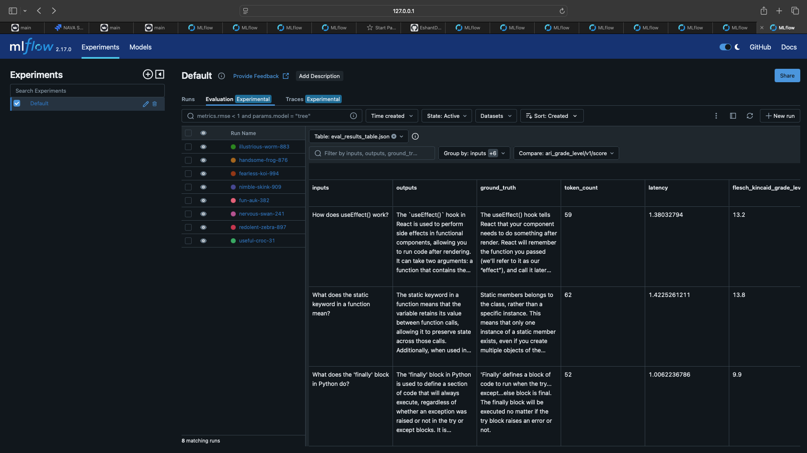
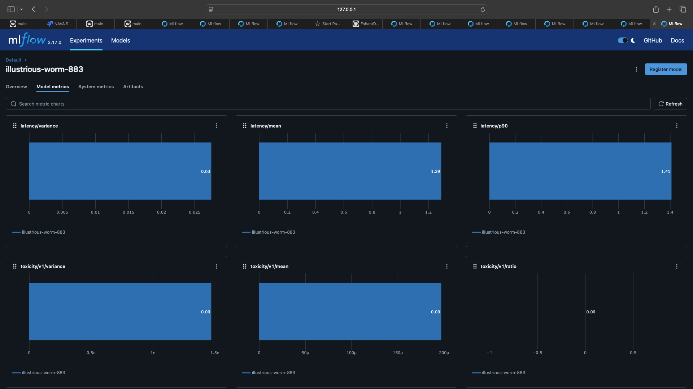
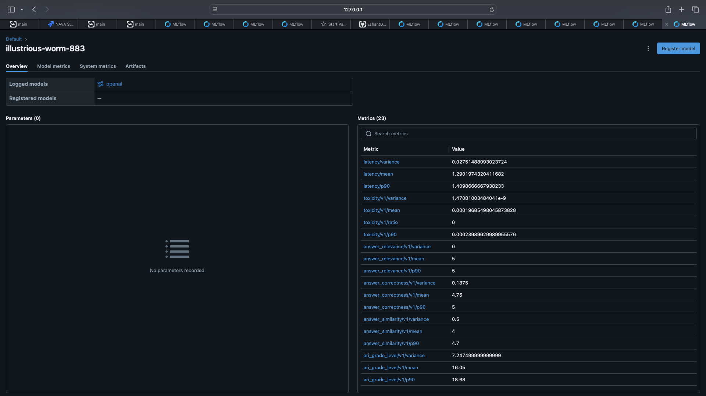

# LLM Monitoring & Evaluation with MLflow

This project is focused on monitoring and evaluating Large Language Models (LLMs) using MLflow. It demonstrates two key scenarios:
1. **Generating responses from the model and evaluating them.**
2. **Evaluating existing model responses against ground truth.**

<br><br>

## Table of Contents
- [Getting Started](#getting-started)
- [Installation](#installation)
- [Usage](#usage)
  - [Scenario 1: Generating Responses & Evaluating](#scenario-1-generating-responses--evaluating)
  - [Scenario 2: Evaluating Existing Responses](#scenario-2-evaluating-existing-responses)
- [Metrics Explained](#metrics-explained)
- [MLflow UI Dashboard](#mlflow-ui-dashboard)
<br><br>
## Getting Started

This project uses MLflow for tracking, monitoring, and evaluating the performance of LLMs. MLflow's evaluation framework provides a comprehensive set of metrics for assessing model performance.
We can use it for both rag based applications and normal LLM based applications.
<br><br>

## Installation

Before running the code, install the dependencies listed in the `requirements.txt` file:

```bash
pip install -r requirements.txt
```


#### Additional Setup
Make sure to add your OpenAI API keys and other required environment variables to a .env file in the myenv directory:
```makefile
OPENAI_API_KEY=your_openai_api_key
```

<br><br>

## Usage
This project supports two main evaluation scenarios:

<br>

### Scenario 1: Generating Responses & Evaluating
In this scenario, we generate responses using an LLM and then evaluate them against ground truth.

Code Overview:

1. Create a DataFrame containing inputs and ground truth responses.
2. Use MLflow to log the model and generate responses.
3. Evaluate the generated responses using various metrics.
4. Display the evaluation results.

<br>

```python
# Create a DataFrame with inputs and ground truth
eval_df = pd.DataFrame({
    "inputs": [
        "How does useEffect() work?",
        "What does the static keyword in a function mean?",
        ...
    ],
    "ground_truth": [
        "The useEffect() hook tells React that...",
        ...
    ]
})

# Start an MLflow run, log the model, generate responses, and evaluate them
with mlflow.start_run() as run:
    system_prompt = "Answer the following question in two sentences"
    basic_qa_model = mlflow.openai.log_model(
        model="gpt-4o-mini",
        task=openai.chat.completions,
        ...
    )
    results = mlflow.evaluate(
        basic_qa_model.model_uri,
        eval_df,
        targets="ground_truth",
        ...
    )

# Display average metrics
print(results.metrics)

#Display the dataframe for seeing the metrics for individual questions in the form of dataframe 
results.tables["eval_results_table"]
```

<br><br>

### Scenario 2: Evaluating Existing Responses

In this scenario, the responses are pre-generated, and we evaluate them directly against the ground truth.

Code Overview:

1. Create a DataFrame containing inputs, ground truth, and predicted responses.
2. Evaluate the responses using MLflow.

<br>

```python
# Create a DataFrame with inputs, ground truth, and predicted responses
eval_df = pd.DataFrame({
    "inputs": [
        "How does useEffect() work?",
        ...
    ],
    "ground_truth": [
        "The useEffect() hook tells React that...",
        ...
    ],
    "predicted_answer": [
        "The useEffect() hook is used to...",
        ...
    ]
})

# Start an MLflow run for evaluation
with mlflow.start_run() as run:
    results = mlflow.evaluate(
        model=None,
        data=eval_df,
        targets="ground_truth",
        predictions="predicted_answer",
        ...
    )

# Display average metrics
print(results.metrics)

#Display the dataframe for seeing the metrics for individual questions in the form of dataframe 
results.tables["eval_results_table"]
```


<br><br>

## Metrics Explained

Here are the key metrics used in this evaluation framework:

- **latency/mean**: The average time taken to generate responses. <br><br>
- **exact_match/v1**: <br>
  This function creates a metric for calculating accuracy using sklearn.  <br>
  This metric only computes an aggregate score, which ranges from 0 to 1.  <br>
  Refer to the [accuracy](https://scikit-learn.org/stable/modules/generated/sklearn.metrics.accuracy_score.html) documentation for more details. <br><br>
- **flesch_kincaid_grade_level/v1/score**: 
  The Flesch-Kincaid Grade Level is a readability metric used to determine the difficulty of understanding a text based on the length of words and sentences.<br>
  The score ranges from 0 to 18, where higher values indicate more complex text. Here's how the grade level is interpreted:

  | Value | School Level            | Student Age Range | Notes                                                             |
  |-------|-------------------------|-------------------|-------------------------------------------------------------------|
  | 0-1   | Pre-kindergarten - 1st grade | 3-7           | Basic level for those just learning to read books.               |
  | 1-5   | 1st grade - 5th grade   | 7-11              | Very easy to read.                                               |
  | 5-11  | 5th grade - 11th grade  | 11-17             | Average level. Suitable for most marketing materials.            |
  | 11-18 | 11th grade - 18th grade | 17 and above      | For skilled readers, e.g., academic papers.                      |     <br><br>

  <br><br>
- **ari_grade_level/v1/score**: 
  The Automated Readability Index (ARI) calculates a score that indicates how easy or difficult a text is to read, based on the length of words and sentences.<br>
   The ARI score can be interpreted to identify the approximate U.S. grade level of the text.<br>
    This formula, developed by Rudolf Flesch, is famous for measuring readability and promoting clear writing. Here's how the ARI score is interpreted:<br>
    | ARI Score | Grade Level       | Reading Level         | Ages         |
  |-----------|-------------------|------------------------|--------------|
  | 1 – 5     | Kindergarten      | Extremely Easy         | 5-6 yrs. old |
  | 1 – 5     | First Grade       | Extremely Easy         | 6-7 yrs. old |
  | 6 – 7     | Second Grade      | Very Easy              | 7-8 yrs. old |
  | 8 – 9     | Third Grade       | Very Easy              | 8-9 yrs. old |
  | 10 – 11   | Fourth Grade      | Easy                   | 9-10 yrs. old|
  | 12 – 13   | Fifth Grade       | Fairly Easy            | 10-11 yrs. old|
  | 14 – 15   | Sixth Grade       | Fairly Easy            | 11-12 yrs. old|
  | 16 – 17   | Seventh Grade     | Average                | 12-13 yrs. old|
  | 18 – 19   | Eighth Grade      | Average                | 13-14 yrs. old|
  | 20 – 21   | Ninth Grade       | Slightly Difficult     | 14-15 yrs. old|
  | 22 – 23   | Tenth Grade       | Somewhat Difficult     | 15-16 yrs. old|
  | 24 – 25   | Eleventh Grade    | Fairly Difficult       | 16-17 yrs. old|
  | 26 – 27   | Twelfth Grade     | Difficult              | 17-18 yrs. old|
  | 28 and above | College        | Very Difficult         | 18-22 yrs. old|<br><br>
<br><br>

- **answer_similarity/v1/score**: <br>
Assesses the similarity between the predicted response and the ground truth.<br>
Purpose: This endpoint likely calculates the similarity between two given answers.<br>
Functionality: When you send a request to this endpoint, you would typically provide two answers as input. The endpoint would then process these answers and return a numerical score representing their <br> similarity. A higher score indicates greater similarity between the answers.


- **answer_similarity/v1/justification**: Provides the reasoning for the similarity score. <br><br>
- **answer_relevance/v1/score**: <br>
Purpose: This endpoint assesses the relevance of an answer to a given question.<br>
Functionality: You would send a question and an answer as input to this endpoint. The endpoint would then analyze the answer and determine how relevant it is to the question. The returned score would <br>
indicate the degree of relevance, with higher scores signifying greater relevance.<br>
- **answer_relevance/v1/justification**: Explains the relevance score.  <br><br>
- **answer_correctness/v1/score**: <br>
Purpose: This endpoint likely evaluates the correctness of an answer with respect to a given question.<br>
Functionality: You would send a question and an answer as input to this endpoint. The endpoint would then compare the answer to a correct or reference answer and determine its correctness.<br>
The returned score would indicate the degree of correctness, with higher scores representing more accurate answers.<br>
- **answer_correctness/v1/justification**: Provides the justification for the correctness score. <br><br>


These metrics help in understanding the quality of the generated responses in terms of correctness, relevance, similarity, and readability.


<br><br>
## MLflow UI Dashboard
To visualize the evaluation results, you can launch the MLflow UI. Run the following command in your terminal:


```bash
mlflow ui --host 127.0.0.1 --port 3000
```

This will start the MLflow UI on http://127.0.0.1:3000, where you can explore the metrics and results of the evaluations in a user-friendly interface.






